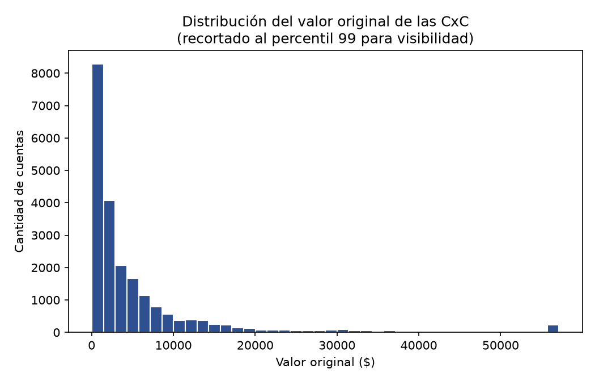
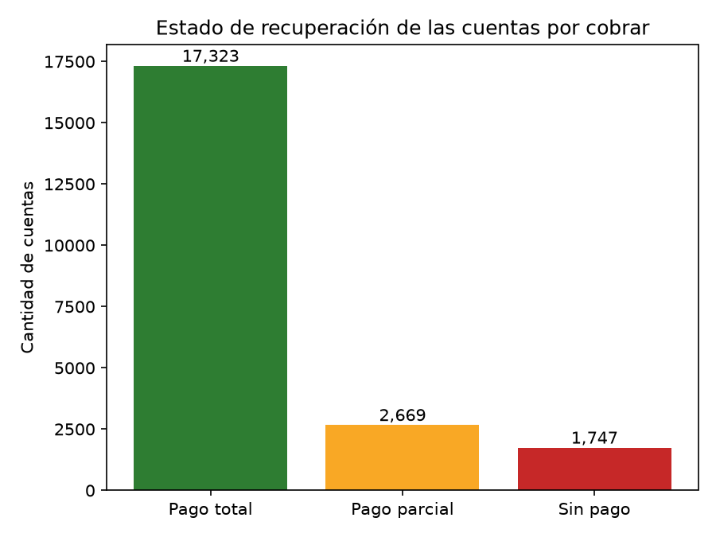
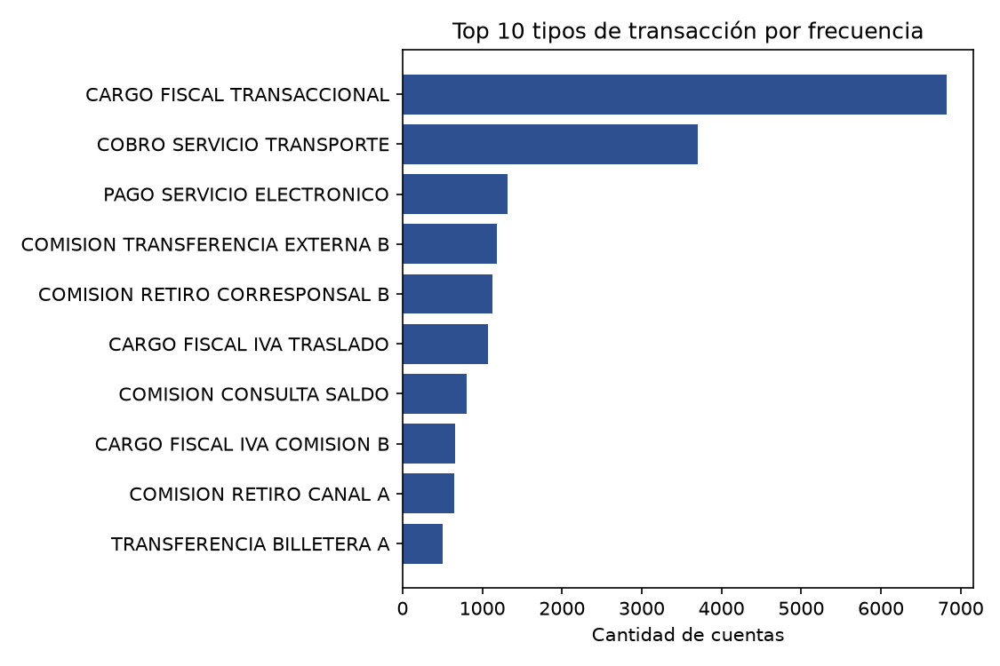

# Exploración de datos y modelo conceptual de la sábana CxC

## 1. Fuente de datos

La base histórica (`fuente_cxc.sqlite`) contiene una única tabla (`tabla1`) con **21.739 registros**, cada uno representando una cuenta por cobrar (CxC) individual. Las columnas originales son:

| Columna | Descripción |
|---|---|
| `cod_apli_prod` / `descri_cod_apli_prod` | Tipo de producto (S=AHORRO, D=CORRIENTE) |
| `num_cta` | Número de cuenta |
| `f_creacion` | Fecha de creación de la CxC (AAAAMMDD) |
| `f_ultimo_pago` | Fecha del último pago registrado (AAAAMMDD) |
| `vlr_original` | Valor original de la cuenta por cobrar |
| `vlr_pagado` | Valor recuperado a la fecha |
| `vlr_pendiente_pago` | Valor pendiente de recuperar |
| `cod_trn` / `descri_cod_trn` | Código y descripción del tipo de transacción que originó la CxC |
| `year`, `month`, `day` | Fecha de corte/extracción del reporte (ver supuesto 1) |

## 2. Supuestos y decisiones tomadas

1. **`year`, `month`, `day` no se tratan como variables de negocio.** Al revisar sus valores, todos caen en una ventana de 32 días (11-oct a 11-nov-2025), independiente de `f_creacion` o `f_ultimo_pago` de cada cuenta. Se interpretan como la fecha de extracción del reporte de datos, no como parte del ciclo de vida de la cuenta, y por lo tanto se excluyen de la sábana analítica.
2. **La variable objetivo para la Actividad 2 se define como pago completo o no** (`pago_total`), en lugar de un valor continuo de recuperación. Esto convierte el problema en una clasificación binaria, que es más simple de evaluar e interpretar para el caso de negocio.
3. **Las fechas se reconstruyen a partir de enteros AAAAMMDD** (`f_creacion`, `f_ultimo_pago`) para poder calcular diferencias de días en SQL vía `julianday()`.
4. **Los tres estados de recuperación (total / parcial / sin pago) son mutuamente excluyentes** y cubren el 100% de los registros.

## 3. Modelo conceptual de la sábana

La sábana se construye con una consulta de SQL sobre `tabla1`, agregando tres capas de información sobre la fuente original:

- Capa 1: Variables originales (num_cta, descri_cod_apli_prod, descri_cod_trn, f_creacion, f_ultimo_pago, vlr_original, vlr_pagado, vlr_pendiente_pago)
- Capa 2: Variables derivadas (se calculan)
    - porc_recuperado = vlr_pagado / vlr_original
    - dias_hasta_ultimo_pago = f_ultimo_pago - f_creacion (en días)
- Capa 3: Reglas de negocio (estado de cuenta)
    - pago_total = 1 si vlr_pendiente_pago = 0
    - sin_pago = 1 si vlr_pagado = 0
    - pago_parcial = 1 si pagó algo pero quedó saldo pendiente

El resultado de esta consulta se guarda en sabana_cxc.csv.

La query completa está documentada en `src/sql/querys.sql`.

## 4. Hallazgos clave del EDA

**Estado general de recuperación** (n = 21.739 cuentas):

| Estado | Cuentas | % |
|---|---|---|
| Pago total | 17.323 | 79,7% |
| Pago parcial | 2.669 | 12,3% |
| Sin pago | 1.747 | 8,0% |

La gran mayoría de las cuentas (~80%) se recupera en su totalidad. El ~20% restante (pago parcial + sin pago) es el segmento de interés para el modelo de probabilidad de pago y para la gestión de recuperación de cartera.

**Producto:** el 98,9% de las cuentas corresponde a producto AHORRO, con una participación marginal de CORRIENTE (1,1%). Un desbalance a tener en cuenta si se analiza por tipo de producto.

**Tipo de transacción:** la transacción más frecuente es CARGO FISCAL TRANSACCIONAL, con 6.823 casos, seguida de COBRO SERVICIO TRANSPORTE. Existen 71 tipos de transacción distintos, con una cola larga de baja frecuencia.

### Gráfico 1: Distribución del valor original de las CxC

La distribución está fuertemente sesgada a la derecha (la mayoría de las cuentas son de montos bajos, con una cola de valores altos), por eso se recortó al percentil 99 para la visualización. Esto sugiere que, de cara al modelamiento, puede convenir explorar una transformación logarítmica de `vlr_original`.

### Gráfico 2: Estado de recuperación de las cuentas

Confirma visualmente el desbalance entre clases: el modelo de la Actividad 2 deberá considerar este desbalance (~20% de casos "negativos") al elegir métricas de evaluación y, potencialmente, técnicas de balanceo.

### Gráfico 3: Top 10 tipos de transacción por frecuencia

Con 71 categorías distintas de `cod_trn`, para el modelamiento se recomienda agrupar las categorías de baja frecuencia en una categoría "Otros", en vez de usar dummy encoding directo sobre las 71.

## 5. Próximos pasos

Con esta sábana y estos hallazgos como base, la Actividad 2 construye el modelo de probabilidad de pago, y la Actividad 3 consume tanto la sábana como las salidas del modelo para el dashboard de Power BI y el informe ejecutivo.